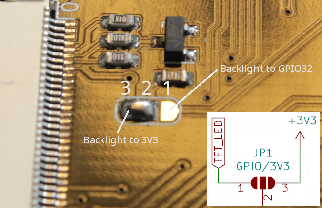

# ESP32 TouchDown

<div class="row justify-content-center">
        <a href="https://raw.githubusercontent.com/HASwitchPlate/openHASP-docs/master/docs/assets/images/devices/esp32-touchdown.jpg" data-toggle="lightbox" data-gallery="example-gallery" class="col-sm-6" data-title="ESP32 TouchDown" data-footer="Original image by Dustin Watts - Used with permission">
            
        </a>

        <a href="https://raw.githubusercontent.com/HASwitchPlate/openHASP-docs/master/docs/assets/images/devices/esp32-touchdown-color_wheel.png" data-toggle="lightbox" data-gallery="example-gallery" class="col-sm-6" data-title="ESP32 TouchDown" data-footer="Original image by Dustin Watts - Used with permission">
            
        </a>
</div>
<div>
        <a href="https://raw.githubusercontent.com/HASwitchPlate/openHASP-docs/master/docs/assets/images/devices/esp32-touchdown-usbc.jpg" data-toggle="lightbox" data-gallery="example-gallery" rel="lightbox[work]" data-title="ESP32 TouchDown" data-footer="Original image by Dustin Watts - Used with permission">more images...</a>
        <a href="https://raw.githubusercontent.com/HASwitchPlate/openHASP-docs/master/docs/assets/images/devices/esp32-touchdown-speaker.jpg" data-toggle="lightbox" data-gallery="example-gallery" rel="lightbox[vacation]" data-title="ESP32 TouchDown" data-footer="Original image by Dustin Watts - Used with permission"></a>
        <a href="https://raw.githubusercontent.com/HASwitchPlate/openHASP-docs/master/docs/assets/images/devices/esp32-touchdown-sdcard.jpg" data-toggle="lightbox" data-gallery="example-gallery" rel="lightbox[vacation]" data-title="ESP32 TouchDown" data-footer="Original image by Dustin Watts - Used with permission"></a>
        <a href="https://raw.githubusercontent.com/HASwitchPlate/openHASP-docs/master/docs/assets/images/devices/esp32-touchdown-features.png" data-toggle="lightbox" data-gallery="example-gallery" rel="lightbox[vacation]" data-title="ESP32 TouchDown" data-footer="Original image by Dustin Watts - Used with permission"></a>
</div>


## Features

   - ESP32-WROOM-32D
   - ILI9488 3.5" (480*320) TFT screen in 4-wire SPI mode
   - FT62x6 Capacitive Touch Controller
   - APK2112 3.3V regulator
   - MCP73831 battery management IC
   - CP2102 USB-to-UART IC
   - USB-C connector
   - Piezo Speaker
   - microSD card holder
   - Battery voltage divider connected to GPIO35
   - Stemma / JST-PH I2C connector
   - Compact size: 100x57x15mm

This board was originaly created for the [FreeTouchDeck project](https://github.com/DustinWatts/FreeTouchDeck)
and the hardware is also open source. Due to the extensive documentation it was easy to port openHASP to the ESP32-Touchdown.

| Pros              | Cons
|:-----             |:----
| 480x320 display   | 4 MB flash
| Capactitive touch | No PSram
| Battery connector |
| Battery sensor    |

The speaker and SD card are not supported by openHASP 0.6.1.

Available from:</br>
[:material-cart-variant: Tindie][1]{ .md-button .md-button--primary } &nbsp; 
[:material-cart-variant: Eplop (UK)][2]{ .md-button .md-button--primary } &nbsp; 
[:material-cart-variant: PCBway][3]{ .md-button .md-button--primary }

## Product Video

<div class="embed-responsive embed-responsive-16by9" style="max-width:560px; margin:auto;">
    <iframe title="YouTube video player" src="https://www.youtube.com/embed/TJTbuOdeoFw?rel=0&controls=1" class="embed-responsive-item" frameborder="0" allow="accelerometer; clipboard-write; encrypted-media; gyroscope; picture-in-picture" allowfullscreen>
    </iframe>
</div>

## Backlight Control

To enable backlight control, make sure the solder jumper pad is in position 2-1:



## 3D Printed Cases

You can find several different [3D printable cases](https://github.com/DustinWatts/esp32-touchdown/tree/main/Case) in the [ESP32 TouchDown repository](https://github.com/DustinWatts/esp32-touchdown/):

## Flashing

The ESP32 TouchDown can easily be flashed over USB like any ESP32 development board.

## GPIO Settings

These pins can be used freely as GPIOs:

## PCB Blueprint

The ESP32 TouchDown is fully [Open Source Hardware](https://github.com/DustinWatts/esp32-touchdown/tree/main/Hardware):

- Schematics
- Bill of materials
- PCB layout
- Datasheets


## HASP build_flags

Specify the LCD Configuration to use and define the GPIOs in the environment build flags:

```ini
build_flags =
    ${env.build_flags}
    ${esp32.build_flags}
    ${esp32.vspi}        ; Use VSPI hardware SPI bus

;region -- TFT_eSPI build options ------------------------
    -D USER_SETUP_LOADED=1
    -D ILI9488_DRIVER=1
    -D TFT_ROTATION=0 ; 0=0, 1=90, 2=180 or 3=270 degree
    -D TFT_WIDTH=320
    -D TFT_HEIGHT=480
    -D TFT_CS=15  ;// Chip select control pin
    -D TFT_DC=2  ;// Data Command control pin
    -D TFT_RST=4 ;// Reset pin (could connect to RST pin)
    -D TFT_BCKL=5  ;None, configurable via web UI (e.g. 2 for D4)
    -D SUPPORT_TRANSACTIONS
    -D TOUCH_DRIVER=6336 ; XPT2606 Resistive touch panel driver 
    -D TOUCH_SDA=21
    -D TOUCH_SCL=22
    -D TOUCH_IRQ=27   ; not connected
    -D TOUCH_RST=-1   ; not used, connected to 3.3V
    -D TOUCH_FREQUENCY=400000
    -D SPI_FREQUENCY=27000000
    -D SPI_READ_FREQUENCY=16000000
;endregion
```

[1]: https://www.tindie.com/products/dustinwattsnl/esp32-touchdown/
[2]: https://store.eplop.co.uk/product/esp32touchdown/
[3]: https://www.pcbway.com/project/gifts_detail/ESP32_TouchDown.html