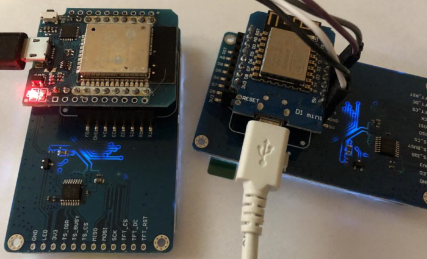
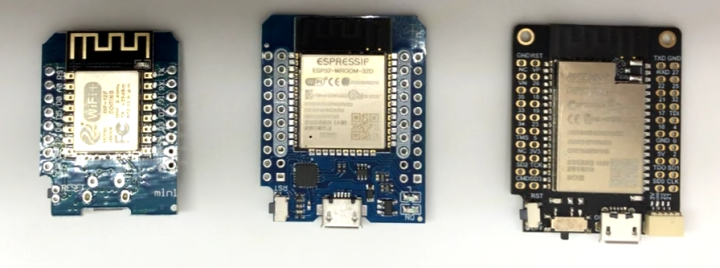

<h1>Getting Started</h1>

openHASP supports the ESP32, ESP8266 and STM32F4 families of microcontrollers.
It needs a compatible micro-controller with drivers supporting the attached display, touch controller, storage and network.

Below is a list of recommended development boards and a TFT touchscreen to get you up-and-running in no time.

## Recommended Boards

|&nbsp;       | Minimal     | Basic        | Standard
|:----        |:----:       |:----:        |:----:
| MCU         | ESP8266     | ESP32-WROOM  | ESP32-WROVER 
| CPU Freq.   | 80Mhz       | 240Mhz       | 240Mhz   
| Ram         | 80Kb        | 520Kb        | 520Kb
| PSRam       | no          | no           | yes
| Minimal Flash | 4MB         | 4MB          | 4MB
| Display     | ILI9341 SPI | ILI9341 SPI  | ILI9341 SPI
| Touch       | XPT2046 SPI | XPT2046 SPI  | XPT2046 SPI
| Network     | Wi-Fi        | Wi-Fi         | Wi-Fi
| Dev. Board* |[D1 mini ESP8266][3]{target=_blank}|[D1 mini ESP32][4]{target=_blank}|[TTGO T7 v1.5 Mini32][5]{target=_blank}
| Firmware    | [Download][1]{target=_blank} | [Download][1]{target=_blank}  | [Download][1]{target=_blank}

[1]: https://github.com/HASwitchPlate/openHASP/releases
[3]: https://www.aliexpress.com/item/32643142716.html
[4]: https://www.aliexpress.com/item/32815530502.html
[5]: https://www.aliexpress.com/item/32977375539.html

!!! note
    *Due to the large number of possible hardware options a selection of 3 popular ESP development boards has been made for the precompiled binaries.*

For new projects we recommend ESP32-WROVER boards with PSram.

The performance of the ESP8266 will be slow due to its low memory and CPU frequency.
It is okay for getting started, for small project where speed is not needed or when you have one at hand.

!!! tip
    Advanced users can build and compile custom configurations using PlatformIO [locally](compiling/local.md) or [online with Gitpod](compiling/gitpod.md), however this is not currently supported.

## Recommended Display
### Lolin TFT 2.4"

ILI9341 SPI touchscreens with backlight dimming via PWM are quite cheap to get.
An ILI9341 TFT display with SPI is required when using a pre-built binary.
The touch controller needs to be the XPT2046 Resistive Touch driver.

The Lolin TFT 2.4" is **plug-and-play** with the 3 recommended ESP development boards.
If you have another ESP or MCU, you can still use this display using jumper cables.
You can also solder a row of headers at the bottom of the display to plug it into a breadboard.
Therefor the Lolin TFT 2.4 Touch Shield is used as the development display of choice.

##### Backlight Control

To use PWM dimming on the Lolin TFT 2.4" you must connect the TFT-LED pin to either D1, D2 or D4.
**D1 is recommended** for backlight control and configured by default.

!!! warning "Do *not* use D3 for backlight control because it is already in use for touch!"

!!! warning ""
    It is *not* recommended to use D4 for backlight control because it is already in use for PSram on the ESP32-Wrover.
    The D1-mini has D4 connected to on-board LED and boot fails if pulled LOW

### Compatible ESP boards

The Lolin TFT 2.4" header is **plug-and-play** compatible with these development boards,
no need to use any jumper cables:

**ESP32:**

- Wemos D1 Mini ESP32 *(**only** solder the inner row of pin headers)*
- TTGO T7 V1.5 MINI32 ESP32 *(**only** solder the inner row of pin headers)*
- LOLIN D32 Pro V2.0.0 *using an **additional** TFT cable*

**ESP8266:**

- Wemos D1 Mini ESP8266
- Lolin D1 Mini Pro ESP8266 V2.0.0

!!! note
    If you have a Lolin TFT 2.4" Display and a compatible ESP development board, you have all the hardware that is needed.
    In that case you can skip ahead to the [Firmware Installation](installation/esp32.md).

## Alternative SPI Display

Any common ILI9341 320x240 4-wire SPI touchscreen with XPT2046 Resistive Touch driver can be used, like:

- 2.4" SKU: [MSP2402](http://www.lcdwiki.com/2.4inch_SPI_Module_ILI9341_SKU:MSP2402){target=_blank}
- 2.8" SKU: [MSP2807](http://www.lcdwiki.com/2.8inch_SPI_Module_ILI9341_SKU:MSP2807){target=_blank}
- 3.2" SKU: [MSP3218](http://www.lcdwiki.com/3.2inch_SPI_Module_ILI9341_SKU:MSP3218){target=_blank}

You will need to connect [the GPIO pins](displays/MSPxxxx.md) using jumper wires.

## Ready-made devices

Some manufacturers offer IoT devices which are ready to go with openHASP:

- [ESP32-Touchdown](devices/esp32-touchdown.md)
- [FreeTouchDeck](devices/freetouchdeck.md)
- [Lanbon L8](devices/lanbon-l8.md)
