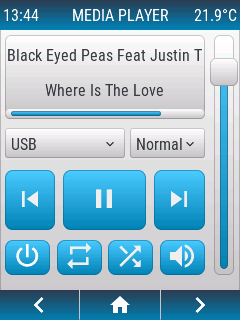
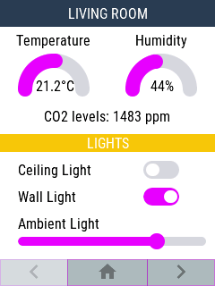
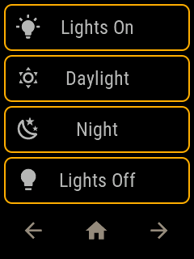

</img>
openHASP 0.6

Control your home-automation devices from a customizable touchscreen UI connected via MQTT.

openHASP is a re-implementation of the popular HASwitchPlate sketch created by aderusha.
The [HASPone][1] project uses a Wemos D1 mini and requires a Nextion/TJC HMI display.
This rewrite removes the Nextion/TJC requirement by using the [Light and Versatile Graphics Library][2]
on the MCU to drive a commodity display.

This project also adds ESP32 and STM32F4 support to take advantage of the additional hardware capabilities.

### Demo Screens

 &nbsp; 
 &nbsp;     
 &nbsp;
 &nbsp; 

### Features

| Feature                 | ESP8266 | ESP32   | STM32F4
|-------------------------|---------|---------|----------
| SPI display             | :white_check_mark: yes | :white_check_mark: yes | :white_check_mark: yes
| Parallel display        | :x: no | :white_check_mark: yes | :white_check_mark: yes
| PWM Screen dimming      | :white_check_mark: yes | :white_check_mark: yes | :white_check_mark: yes
| Maximum Page Count      | 4       | 12 | 12
| [Object Types / Widgets][7]| 20      | 20 | 20
| Dynamic Objects         | :white_check_mark: yes | :white_check_mark: yes | :white_check_mark: yes
| Theme Support           | yes     | yes     | yes
| [Custom .zi V5 font][4] | :white_check_mark: yes (latin1) | :white_check_mark: yes (latin1) | no
| MDI Icons               | :white_check_mark: yes | :white_check_mark: yes | no
| [PNG images][8]         | :x: no | :white_check_mark: yes | :white_check_mark: yes
| Network                 | :white_check_mark: Wi-Fi | :white_check_mark: Wi-Fi | :white_check_mark: Ethernet

### Support

For support using openHASP please find us on Github, Discord or Home Assistant:

[:material-github: Github Discussions][3]{ .md-button .md-button--primary }
[:material-discord: Discord Chat][5]{ .md-button .md-button--primary }
[:material-home-assistant: Home Assistant Forum][6]{ .md-button .md-button--primary }

[1]: https://github.com/HASwitchPlate/HASPone
[2]: https://github.com/lvgl/lvgl
[3]: https://github.com/HASwitchPlate/openHASP/discussions
[4]: https://github.com/fvanroie/HMI-Font-Pack/releases
[5]: https://discord.gg/VCWyuhF
[6]: https://community.home-assistant.io/t/openhasp-an-mqtt-driven-touchscreen-scene-controller/300853
[7]: design/objects/#cheatsheet
[8]: design/objects/#image