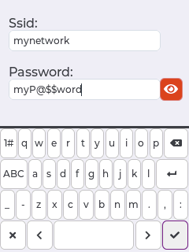

# Wi-Fi Setup

At first boot, when no Wi-Fi setup is found, the device will create an initial Access Point for configuring the device.
If the touchscreen is properly connected it will display a QR code, along with a temporary SSID and password, to connect to the device.




!!! note "Tip"
    To skip this step, Wi-Fi credentials can be saved into the .bin file when you compile the firmware yourself using [customization](../compiling/customize.md). 

Either use the touchscreen interface or connect via a web browser to setup the credentials for your local Wi-Fi access point:

## Using Touchscreen

1. Tap on the screen to start a Touch Calibration sequence:
2. Precisely touch the 4 corners as indicated
3. Use the on-screen keyboard to enter your local SSID and password
  - Tap on the Checkmark button in the lower righthand corner to save the settings

The device will validate the entered credentials and reboot if they are correct.

## Using Wi-Fi Access-Point

Connect to the temporary Access Point by scanning the QR on the display, if available.
Or Check the serial log for the SSID and password to connect.

- Browse to `http://192.168.4.1`
- Enter your local SSID and password for joining the device to your wireless network
- Click Save Settings
- The device will automatically reboot and connect to your wireless LAN

## Using Command line

You can also directly configure the Wi-Fi settings via the serial console:

```bash
ssid myAccessPointName
pass myWifiPassword
reboot
```


