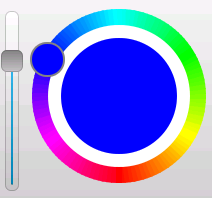
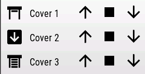
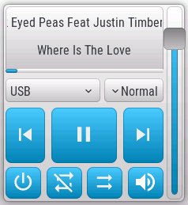
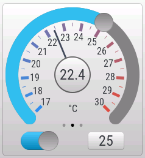

## Display clock and temperature


The easiest example is to display the state of a clock and a temperature sensor from Home Assistant, using _label_ objects in openHASP.

Create a label object to display the temperature value, a separate label object to display the unit and a third label object for the clock:

```json
{"page":0,"id":4,"obj":"label","x":175,"y":5,"h":30,"w":45,"text":"00.0","align":2,"bg_color":"#2C3E50"}
{"page":0,"id":5,"obj":"label","x":220,"y":5,"h":30,"w":45,"text":"°C","align":0,"bg_color":"#2C3E50"}
{"page":0,"id":6,"obj":"label","x":3,"y":5,"h":30,"w":62,"text":"00:00","align":0,"bg_color":"#2C3E50"}
```

In component configuration all you need for the objects is:

```yaml
    objects:
      - obj: "p0b4"
        properties:
          "text": "{{ states('sensor.my_room_temperature') }}"
      - obj: "p0b6"
        properties:
          "text": "{{ states('sensor.time') }}"
```

#### Note:
You can of course omit the second label object with the unit and use the same for both value and unit:

```json
{"page":0,"id":4,"obj":"label","x":175,"y":5,"h":30,"w":62,"text":"00.0°C","align":2,"bg_color":"#2C3E50"}
{"page":0,"id":6,"obj":"label","x":3,"y":5,"h":30,"w":62,"text":"00:00","align":0,"bg_color":"#2C3E50"}
```

In component configuration you will add the unit to the value using the template:

```yaml
    objects:
      - obj: "p0b4"
        properties:
          "text": "{{ states('sensor.my_room_temperature') }}°C"
```

All these being on page 0 means that they will appear on all the pages.

*  *  *  *  *

## Some basic controls

Jsonl and Home Assistant configuration:

#### Toggle a light (or any switchable entity with on/off states)


```json
{"page":1,"id":2,"obj":"btn","x":10,"y":40,"w":105,"h":90,"toggle":true,"text":"\uE335","text_font":32,"align":1}
```

```yaml
      - obj: "p1b2" # switch, checkbox or btn with toggle true
        properties:
          "val": '{{ 1 if is_state("light.my_lamp", "on") else 0 }}'
          "text": '{{ "\uE6E8" if is_state("light.my_lamp", "on") else "\uE335" | e }}'
        event:
          "down":
            - service: homeassistant.toggle
              entity_id: "light.my_lamp"
```

#### Dropdown (self-populating from an input_select)

```json
{"page":1,"id":3,"obj":"dropdown","x":5,"y":40,"w":230,"h":30,"options":""}
```

```yaml
      - obj: "p1b3" # dropdown
        properties:
          "options": >
            {{item+"\n"|e}}
          "val": >
            
            {{loop.index -1 if item == states('input_select.my_dropdown_selections') }}
            
        event:
          "changed":
            - service: input_select.select_option
              data:
                entity_id: input_select.my_dropdown_selections
                option: "{{ text }}"
```

See the other examples for pairing different kinds of objects to different kinds of Home Assistant entities.


*  *  *  *  *

## RGB light color



Have an RGB light in Home Assistant controlled by hasp-lvgl. In our example we use Lanbon L8's moodlight.

relevant **openHASP config:**

```json
{"page":1,"id":4,"obj":"cpicker","x":20,"y":70,"w":200,"h":200}
```

relevant **openHASP-custom-component config:**

```yaml
      - obj: "p1b4" # color picker
        properties:
          "color": >
            
            
            {{ "#%02x%02x%02x" | format(rgb[0],rgb[1],rgb[2]) }}            
            
        event:
          "up":
            - service: light.turn_on
              data:
                entity_id: light.openhasp_lanbon_test_moodlight
                rgb_color: "[{{ r }},{{ g }},{{ b }}]"
```
The `color` property gets updated from the `rgb_color` attriburte of `light.openhasp_lanbon_test_moodlight`. The R, G and B decimal color values are converted to hexadecimal html color code using a template whenever the color of the light changes in Home Assistant.

Whenever somebody changes the color of the `cpicker` object on the plate, the light in Home Assustant gets updated with `rgb_color` values received in the MQTT message.

*  *  *  *  *

## Cover with state feedback

  


The icon on the up and down buttons change color when covers move and set opacity when reached to limit. UI theme set to `Hasp Light` in plate's web interface. 

relevant **openHASP config:** (screen size 240x320) 

```json
{"page":1,"id":4,"obj":"btn","x":5,"y":140,"w":73,"h":60,"toggle":false,"text":"\uE05D","text_font":32}
{"page":1,"id":5,"obj":"btn","x":83,"y":140,"w":73,"h":60,"toggle":false,"text":"\uE4DB","text_font":32}
{"page":1,"id":6,"obj":"btn","x":161,"y":140,"w":73,"h":60,"toggle":false,"text":"\uE045","text_font":32}
```

relevant **openHASP-custom-component config:**

```yaml
      - obj: "p1b4"
        properties:
          "text_color": "{{ '#FFFF00' if is_state('cover.cover_1', 'opening') else '#FFFFFF' }}"
          "text_opa": "{{ '80' if is_state_attr('cover.cover_1','current_position', 100) else '255' }}"
        event:
          "down":
            - service: cover.open_cover
              target:
                entity_id: "cover.cover_1"
      - obj: "p1b5"
        properties:
          "text": >
            
            {{ "\uE4DB" | e }}
            
            {{ "\uE4DB" | e }}
            
            {{ "\uF11C" | e }}
            
            {{ "\uF11E" | e }}
            
        event:
          "down":
            - service: cover.stop_cover
              target:
                entity_id: "cover.cover_1"
      - obj: "p1b6"
        properties:
          "text_color": "{{ '#FFFF00' if is_state('cover.cover_1', 'closing') else '#FFFFFF' }}"
          "text_opa": "{{ '80' if is_state_attr('cover.cover_1','current_position', 0) else '255' }}"
        event:
          "down":
            - service: cover.close_cover
              target:
                entity_id: "cover.cover_1"
```

*  *  *  *  *

## Cover with button matrix

A simpler cover control with only basic feedback. UI theme set to `Hasp Light` in plate's web interface. 

relevant **openHASP config:** (screen size 240x320) 

```json
{"page":4,"id":20,"obj":"btnmatrix","x":0,"y":20,"w":240,"h":70,"options":["\uE05D","\uE4DB","\uE045"],"text_font":32,"bg_opa":0,"border_opa":0}
```

relevant **openHASP-custom-component config:**

```yaml
      - obj: "p4b20"
        properties:
          "options": >
            
            ["\uE05D","\uE4DB","#FFFF00 \uE045"]
            
            ["#FFFF00 \uE05D","\uE4DB","\uE045"]
            
            ["\uE05D","\uE4DB","\uE045"]
            
        event:
          "down":
            - service: >
                
                cover.open_cover
                
                cover.stop_cover
                
                cover.close_cover
                
              target:
                entity_id: cover.cover_1
```

*  *  *  *  *

## Covers like in Lovelace

  

The icon behaves like in Lovelace. UI theme set to `Hasp Light` in plate's web interface.

relevant **openHASP config:** (screen size 240x320, UI Theme: Hasp Light) 

```json
{"page":5,"id":12,"obj":"label","x":8,"y":33,"w":35,"h":35,"text":"\uF11D","align":1,"text_font":32,"text_color":"#053248"}
{"page":5,"id":13,"obj":"label","x":48,"y":43,"w":80,"h":30,"text":"Cover 1","align":0,"text_font":16,"text_color":"#053248"}
{"page":5,"id":14,"obj":"btn","x":125,"y":37,"w":30,"h":30,"toggle":false,"text":"\uE05D","text_font":32,"bg_opa":0,"border_opa":0,"text_color":"#053248"}
{"page":5,"id":15,"obj":"btn","x":165,"y":37,"w":30,"h":30,"toggle":false,"text":"\uE4DB","text_font":32,"bg_opa":0,"border_opa":0,"text_color":"#053248"}
{"page":5,"id":16,"obj":"btn","x":205,"y":37,"w":30,"h":30,"toggle":false,"text":"\uE045","text_font":32,"bg_opa":0,"border_opa":0,"text_color":"#053248"}

{"page":5,"id":22,"obj":"label","x":8,"y":69,"w":35,"h":35,"text":"\uF11D","align":1,"text_font":32,"text_color":"#053248"}
{"page":5,"id":23,"obj":"label","x":48,"y":79,"w":80,"h":30,"text":"Cover 2","align":0,"text_font":16,"text_color":"#053248"}
{"page":5,"id":24,"obj":"btn","x":125,"y":73,"w":30,"h":30,"toggle":false,"text":"\uE05D","text_font":32,"bg_opa":0,"border_opa":0,"text_color":"#053248"}
{"page":5,"id":25,"obj":"btn","x":165,"y":73,"w":30,"h":30,"toggle":false,"text":"\uE4DB","text_font":32,"bg_opa":0,"border_opa":0,"text_color":"#053248"}
{"page":5,"id":26,"obj":"btn","x":205,"y":73,"w":30,"h":30,"toggle":false,"text":"\uE045","text_font":32,"bg_opa":0,"border_opa":0,"text_color":"#053248"}
```

relevant **openHASP-custom-component config:**

```yaml
      - obj: "p5b12"
        properties:
          "text": >
            
            {{ "\uE6C0" | e }}
            
            {{ "\uE6C3" | e }}
            
            {{ "\uF11C" | e }}
            
            {{ "\uF11E" | e }}
            
      - obj: "p5b14"
        event:
          "down":
            - service: cover.open_cover
              target:
                entity_id: "cover.my_cover"
      - obj: "p5b15"
        event:
          "down":
            - service: cover.stop_cover
              target:
                entity_id: "cover.my_cover"
      - obj: "p5b16"
        event:
          "down":
            - service: cover.close_cover
              target:
                entity_id: "cover.my_cover"
```
<video width="360" height="640" controls>
  <source src="../../../assets/videos/cc_sampl_cover_lovelace.mp4" type="video/mp4">
Your browser does not support the video tag.
</video>

Check out the [Lovelace-like entities](../examples/example-lovelace.md) for similar placement.  

*  *  *  *  *

## Media player

  

The labels with artist and title are scrolling, the progressbar fills if the media player provides duration and playback position. The dropdown lists containing the available sources and sound modes of the player get populated automatically by the values existing on the player in Home Assistant, also the actually selected value is in sync with the values selected in Home Assistant.  
Player availability is shown by the opacity of the buttons. Player state (play/pause) is shown by the middle button. Power state shown by color, repeat, shuffle and muted state shown by appropriate icons on the buttons.
UI theme set to `Hasp Light` in plate's web interface.

relevant **openHASP config:** (screen size 240x320) 

```json
{"page":6,"id":1,"obj":"obj","x":5,"y":35,"w":200,"h":84,"click":0}
{"page":6,"id":2,"obj":"label","x":7,"y":45,"w":196,"h":30,"text":"-","mode":"scroll","align":1}
{"page":6,"id":3,"obj":"label","x":7,"y":80,"w":196,"h":30,"text":"-","mode":"scroll","align":1}
{"page":6,"id":4,"obj":"bar","x":5,"y":108,"w":200,"h":11,"min":0,"max":100}
{"page":6,"id":5,"obj":"dropdown","x":5,"y":128,"w":120,"h":30,"options":"Source1\nSource2\nSource3","direction":3,"max_height":300}
{"page":6,"id":6,"obj":"dropdown","x":130,"y":128,"w":75,"h":30,"options":"Jazz\nPop\nRock","direction":2}
{"page":6,"id":7,"obj":"btn","x":5,"y":170,"w":50,"h":60,"toggle":false,"text":"\uE4AE","text_font":32}
{"page":6,"id":8,"obj":"btn","x":63,"y":170,"w":83,"h":60,"toggle":false,"text":"\uE40A","text_font":32}
{"page":6,"id":9,"obj":"btn","x":154,"y":170,"w":51,"h":60,"toggle":false,"text":"\uE4AD","text_font":32}
{"page":6,"id":10,"obj":"slider","x":212,"y":35,"w":22,"h":245,"min":0,"max":100}
{"page":6,"id":12,"obj":"btn","x":57,"y":242,"w":45,"h":37,"toggle":false,"text":"\uE457","text_font":32}
{"page":6,"id":13,"obj":"btn","x":108,"y":242,"w":45,"h":37,"toggle":false,"text":"\uE49E","text_font":32}
{"page":6,"id":14,"obj":"btn","x":5,"y":242,"w":45,"h":37,"toggle":false,"text":"\uE425","text_font":32}
{"page":6,"id":15,"obj":"btn","x":160,"y":242,"w":45,"h":37,"toggle":false,"text":"\uE57E","text_font":32}
```

relevant **openHASP-custom-component config:**

```yaml
      - obj: "p6b2" # artist
        properties:
          "text": "{{ state_attr('media_player.sound_my_room','media_artist') if state_attr('media_player.sound_my_room','media_artist') else '-' }}"

      - obj: "p6b3" # title
        properties:
          "text": "{{ state_attr('media_player.sound_my_room','media_title') if state_attr('media_player.sound_my_room','media_title') else '-' }}"

      - obj: "p6b5" # sources list
        properties:
          "options": >
            {{"(no source)\n"|e}}{{source+"\n"|e}}
          "val": >
            
            {{loop.index if source == state_attr('media_player.sound_my_room','source') }}
            
          "click": "{{ 'false' if (is_state('media_player.sound_my_room','unavailable') or is_state('media_player.sound_my_room','unknown')) else 'true' }}"
        event:
          "changed":
            - service: media_player.select_source
              data:
                entity_id: media_player.sound_my_room
                source: "{{ text }}"

      - obj: "p6b6" # sound modes list
        properties:
          "options": >
            {{soundmode+"\n"|e}}
          "val": >
            
            {{loop.index -1 if source == state_attr('media_player.sound_my_room','sound_mode') }}
            
          "click": "{{ 'false' if (is_state('media_player.sound_my_room','unavailable') or is_state('media_player.sound_my_room','unknown')) else 'true' }}"
        event:
          "changed":
            - service: media_player.select_sound_mode
              data:
                entity_id: media_player.sound_my_room
                sound_mode: "{{ text }}"

      - obj: "p6b4" # progressbar
        properties:
          "max": "{{ state_attr('media_player.sound_my_room','media_duration') | int }}"
          "val": "{{ state_attr('media_player.sound_my_room','media_position') | int }}"

      - obj: "p6b7" # prev
        properties:
          "text_opa": "{{ '80' if (is_state('media_player.sound_my_room','unavailable') or is_state('media_player.sound_my_room','unknown')) else '255' }}"
        event:
          "down":
            - service: media_player.media_previous_track
              target:
                entity_id: media_player.sound_my_room

      - obj: "p6b9" # next
        properties:
          "text_opa": "{{ '80' if (is_state('media_player.sound_my_room','unavailable') or is_state('media_player.sound_my_room','unknown')) else '255' }}"
        event:
          "down":
            - service: media_player.media_next_track
              target:
                entity_id: media_player.sound_my_room

      - obj: "p6b8" # play/pause
        properties:
          "text": >
            
            {{ "\uE3E4" | e }}
            
            {{ "\uE40A" | e }}
            
          "text_opa": "{{ '80' if (is_state('media_player.sound_my_room','unavailable') or is_state('media_player.sound_my_room','unknown')) else '255' }}"
        event:
          "down":
            - service: media_player.media_play_pause
              target:
                entity_id: media_player.sound_my_room

      - obj: "p6b10" # volume slider
        properties:
          "val": "{{ state_attr('media_player.sound_my_room','volume_level') * 100 | int }}"
          "click": "{{ 'false' if (is_state('media_player.sound_my_room','unavailable') or is_state('media_player.sound_my_room','unknown')) else 'true' }}"
        event:
          "changed":
            - service: media_player.volume_set
              data:
                entity_id: media_player.sound_my_room
                volume_level: "{{ val | int / 100 }}"
          "up":
            - service: media_player.volume_set
              data:
                entity_id: media_player.sound_my_room
                volume_level: "{{ val | int / 100 }}"

      - obj: "p6b12" # repeat
        properties:
          "text": >
            
            {{ "\uE458" | e }}
            
            {{ "\uE456" | e }}
            
            {{ "\uE457" | e }}
            
          "text_opa": "{{ '80' if (is_state('media_player.sound_my_room','unavailable') or is_state('media_player.sound_my_room','unknown')) else '255' }}"
        event:
          "down":
            - service: media_player.repeat_set
              data:
                entity_id: media_player.sound_my_room
                repeat: >
                  
                  all
                  
                  off
                  
                  one
                  

      - obj: "p6b13" # shuffle
        properties:
          "text": >
            
            {{ "\uE49D" | e }}
            
            {{ "\uE49E" | e }}
            
          "text_opa": "{{ '80' if (is_state('media_player.sound_my_room','unavailable') or is_state('media_player.sound_my_room','unknown')) else '255' }}"
        event:
          "down":
            - service: media_player.shuffle_set
              data:
                entity_id: media_player.sound_my_room
                shuffle:  >
                  
                  false
                  
                  true
                  

      - obj: "p6b15" # mute
        properties:
          "text": >
            
            {{ "\uE75F" | e }}
            
            {{ "\uE57E" | e }}
            
          "text_opa": "{{ '80' if (is_state('media_player.sound_my_room','unavailable') or is_state('media_player.sound_my_room','unknown')) else '255' }}"
        event:
          "down":
            - service: media_player.volume_mute
              data:
                entity_id: media_player.sound_my_room
                is_volume_muted:  >
                  
                  false
                  
                  true
                  

      - obj: "p6b14" # power
        properties:
          "text_color": "{{ '#B00000' if states('media_player.sound_my_room') == 'off' else '#FFFFFF' }}"
          "text_opa": "{{ '80' if (is_state('media_player.sound_my_room','unavailable') or is_state('media_player.sound_my_room','unknown')) else '255' }}"
        event:
          "down":
            - service: media_player.toggle
              data:
                entity_id: media_player.sound_my_room

```
Note that the `val` value of the slider is multiplied and divided by 100 when read and set, because [LVGL only suppports integers](../../design/data-types#integer) for object values. By multiplying and dividing by 100, it becomes possible to set volume between 0 and 1 as required by Home Assistant.

*  *  *  *  *

## Generic thermostat/climate

  

This example is a bit more complex in the aspect that it uses several objects put on top of each other, and grouped toghether using the `parentid` parameter.  Special attention goes to an invisible tabview (exteding over the label dispaying the target temperarture) which allows for swiping between an on/off switch and dropdowns for setting the hvac and fan modes.

The target temperature can be set by dragging the arc handle, more precise +/- setting possible by short/long pressing the middle circle containing the current temperature (increasing/decreasing the value by the _temperature step_ defined by the climate entity). Note that the `min`, `max` and `val` values of the arc and gauge are multiplied and divided by 10 when set and read, because [LVGL only suppports integers](../../../design/data-types#integer) for object values. By multiplying and dividing by 10, it becomes possible to set decimal values for climate temperature. 

The number of the ticks on the gauge is determined from the `min`, `max` attributes of the configured climate, likewise the `hvac_modes` and `fan_modes` dropdowns. You can localise these using the `if-else` statements of the template in the configuration of the custom component.

The active area of the arc changes color based on the current hvac mode of the entity.

relevant **openHASP config:** (screen size 240x320) 

```json
{"page":3,"id":10,"obj":"obj","x":5,"y":35,"w":230,"h":250,"click":0}
{"page":3,"id":20,"obj":"arc","x":10,"y":42,"w":220,"h":220,"min":170,"max":300,"val":224,"border_side":0,"type":0,"rotation":0,"start_angle":135,"end_angle":45,"start_angle1":135,"end_angle1":45,"adjustable":"true","line_width":21,"line_width1":21,"line_color1":"#9f96b0","bg_opa":0}
{"page":3,"id":21,"obj":"gauge","x":22,"y":22,"w":176,"h":176,"parentid":20,"min":170,"max":300,"val":224,"format":1,"critical_value":301,"label_count":14,"line_count":27,"border_width":0,"pad_top":2,"pad_bottom":2,"pad_left":2,"pad_right":2,"value_str":"°C","value_ofs_y":45,"value_font":16,"bg_opa":0}
{"page":3,"id":22,"obj":"obj","x":80,"y":80,"w":60,"h":60,"parentid":20,"click":0,"radius":30,"border_width":2,"border_opa":200}
{"page":3,"id":23,"obj":"label","x":0,"y":95,"w":220,"h":30,"parentid":20,"text":"22.4","text_font":24,"align":"center"}
{"page":3,"id":24,"obj":"obj","x":145,"y":245,"w":60,"h":30,"click":0}
{"page":3,"id":25,"obj":"label","x":145,"y":245,"w":60,"h":30,"text":"00.0","text_font":24,"align":"center"}
{"page":3,"id":30,"obj":"tabview","x":0,"y":235,"w":240,"h":80,"btn_pos":0,"bg_opa":0,"border_width":0,"radius":0}
{"page":3,"id":31,"obj":"tab","parentid":30}
{"page":3,"id":32,"obj":"tab","parentid":30}
{"page":3,"id":33,"obj":"tab","parentid":30}
{"page":3,"id":41,"obj":"switch","x":35,"y":10,"w":60,"h":30,"parentid":31,"radius":25,"radius2":25}
{"page":3,"id":42,"obj":"dropdown","x":15,"y":10,"w":110,"h":30,"parentid":32,"options":"hvac_modes","direction":"1"}
{"page":3,"id":43,"obj":"dropdown","x":15,"y":10,"w":110,"h":30,"parentid":33,"options":"fan_modes","direction":"1"}
```

relevant **openHASP-custom-component config:**

```yaml
      - obj: "p3b20"  # arc slider
        properties:
          "val": "{{ state_attr('climate.thermostat_1','temperature') * 10 | int if not (is_state('climate.thermostat_1','unavailable')) }}"
          "min": "{{ state_attr('climate.thermostat_1','min_temp') * 10 | int if not (is_state('climate.thermostat_1','unavailable')) }}"
          "max": "{{ state_attr('climate.thermostat_1','max_temp') * 10 | int if not (is_state('climate.thermostat_1','unavailable')) }}"
          "opacity": "{{ 60 if (is_state('climate.thermostat_1','unavailable') or is_state('climate.thermostat_1','unavailable')) else 255 }}"
          "click": "{{ 'false' if (is_state('climate.thermostat_1','unavailable') or is_state('climate.thermostat_1','unavailable')) else 'true' }}"
          "line_color1": >
            
            {{ "#346beb" }}
            
            {{ "#34bdeb" }}
            
            {{ "#eb3434" }}
            
            {{ "#ebeb34" }}
            
            {{ "#34eb77" }}
            
            {{ "#9f96b0" }}
            
        event:
          "changed":
            - service: climate.set_temperature
              data:
                entity_id: climate.thermostat_1
                temperature: "{{ val | int / 10 }}"
          "up":
            - service: climate.set_temperature
              data:
                entity_id: climate.thermostat_1
                temperature: "{{ val | int / 10 }}"

      - obj: "p3b21"  # gauge current temp
        properties:
          "val": "{{ state_attr('climate.thermostat_1','current_temperature') * 10 | int if not (is_state('climate.thermostat_1','unavailable')) }}"
          "min": "{{ state_attr('climate.thermostat_1','min_temp') * 10 | int if not (is_state('climate.thermostat_1','unavailable')) }}"
          "max": "{{ state_attr('climate.thermostat_1','max_temp') * 10 | int if not (is_state('climate.thermostat_1','unavailable')) }}"
          "critical_value": "{{ (state_attr('climate.thermostat_1','max_temp') * 10 | int + 1) if not (is_state('climate.thermostat_1','unavailable')) }}"
          "label_count": "{{ (state_attr('climate.thermostat_1','max_temp') | int - state_attr('climate.thermostat_1','min_temp') | int + 1) if not (is_state('climate.thermostat_1','unavailable')) }}"
          "line_count": "{{ ((state_attr('climate.thermostat_1','max_temp') | int - state_attr('climate.thermostat_1','min_temp') | int) * 2 + 1) if not (is_state('climate.thermostat_1','unavailable')) }}"

      - obj: "p3b23"  # label current temp (and +/- with short/long touch)
        properties:
          "text": "{{ state_attr('climate.thermostat_1','current_temperature') if not (is_state('climate.thermostat_1','unavailable')) }}"
          "click": "{{ 'false' if (is_state('climate.thermostat_1','unavailable') or is_state('climate.thermostat_1','unavailable')) else 'true' }}"
        event:
          "up":
            - service: climate.set_temperature
              data:
                entity_id: climate.thermostat_1
                temperature: "{{ state_attr('climate.thermostat_1','temperature') + state_attr('climate.thermostat_1','target_temp_step') | float}}" 
          "long":
            - service: climate.set_temperature
              data:
                entity_id: climate.thermostat_1
                temperature: "{{ state_attr('climate.thermostat_1','temperature') - state_attr('climate.thermostat_1','target_temp_step') | float}}" 


      - obj: "p3b25"  # label target temp
        properties:
          "text": "{{ state_attr('climate.thermostat_1','temperature') if not (is_state('climate.thermostat_1','unavailable')) }}"


      - obj: "p3b41"  # on/off switch
        properties:
          "val": "{{ 0 if (is_state('climate.thermostat_1', 'off') or is_state('climate.thermostat_1', 'unavailable')) else 1 }}"
          "click": "{{ 'false' if (is_state('climate.thermostat_1','unavailable') or is_state('climate.thermostat_1','unavailable')) else 'true' }}"
        event:
          "down":
            - service_template: >
                
                climate.turn_on
                
                climate.turn_off
                
              entity_id: "climate.thermostat_1"


      - obj: "p3b42"  # dropdown with hvac_modes
        properties:
          "options": >
            
            
            Off{{"\n"|e}}
            
            Heating{{"\n"|e}}
            
            Cooling{{"\n"|e}}
            
            Heat/Cool{{"\n"|e}}
            
            Drying{{"\n"|e}}
            
            Fan only{{"\n"|e}}
            
            On{{"\n"|e}}
            
            
          "click": "{{ 'false' if (is_state('climate.thermostat_1','unavailable') or is_state('climate.thermostat_1','unavailable')) else 'true' }}"
          "val": >
            
            {{loop.index -1 if mode == states('climate.thermostat_1') }}
            
        event:
          "changed":
            - service: climate.set_hvac_mode
              target:
                entity_id: climate.thermostat_1
              data:
                hvac_mode: >
                  
                  off
                  
                  heat
                  
                  cool
                  
                  heat_cool
                  
                  dry
                  
                  fan_only
                  

      - obj: "p3b43"  # dropdown with fan_modes
        properties:
          "options": >
            
            
            Automatic{{"\n"|e}}
            
            Low{{"\n"|e}}
            
            Medium{{"\n"|e}}
            
            High{{"\n"|e}}
            
            Turbo{{"\n"|e}}
            
            

          "click": "{{ 'false' if (is_state('climate.thermostat_1','unavailable') or is_state('climate.thermostat_1','unavailable')) else 'true' }}"
          "val": >
            
            {{loop.index -1 if mode == state_attr('climate.thermostat_1','fan_mode') }}
            
        event:
          "changed":
            - service: climate.set_fan_mode
              target:
                entity_id: climate.thermostat_1
              data:
                fan_mode: >
                  
                  auto
                  
                  low
                  
                  medium
                  
                  high
                  
                  turbo
                  
```

<video width="360" height="640" controls>
  <source src="../../../assets/videos/cc_sampl_climate_control.mp4" type="video/mp4">
Your browser does not support the video tag.
</video>

*  *  *  *  *

## Color coded icons


<h4>Color code a WiFi icon according to RSSI reported by the plate</h4>

**openHASP config:** (screen size 240x320) 

```json
{"obj":"btn","id":1,"x":120,"y":1,"w":30,"h":40,"text_font":"2","text":"\uE5A9","text_color":"gray","bg_opa":0,"border_width":0}
```

relevant **openHASP-custom-component config:**

```yaml
    - obj: "p0b1"
      properties:
        "text_color": "greenorangetomatored"```
```

<h4>Color code a temperature icon according to sensor values</h4>

**openHASP config:** (screen size 240x320) 

```json
{"obj":"btn","id":3,"x":165,"y":1,"w":30,"h":40,"text_font":"2","text":"\uE50F","text_color":"gray","bg_opa":0,"border_width":0}
```

relevant **openHASP-custom-component config:**

```yaml
    - obj: "p0b3"
      properties:
        "text_color": "#4682B4greenred"
```

